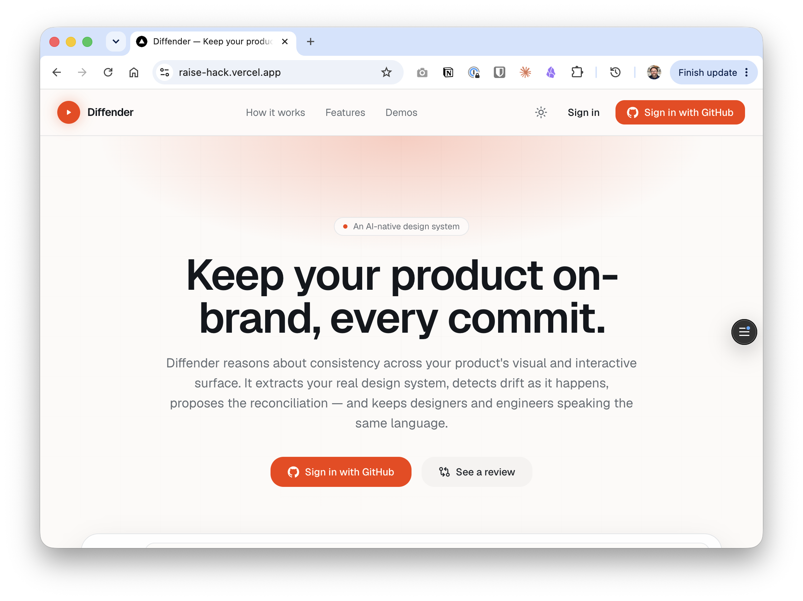
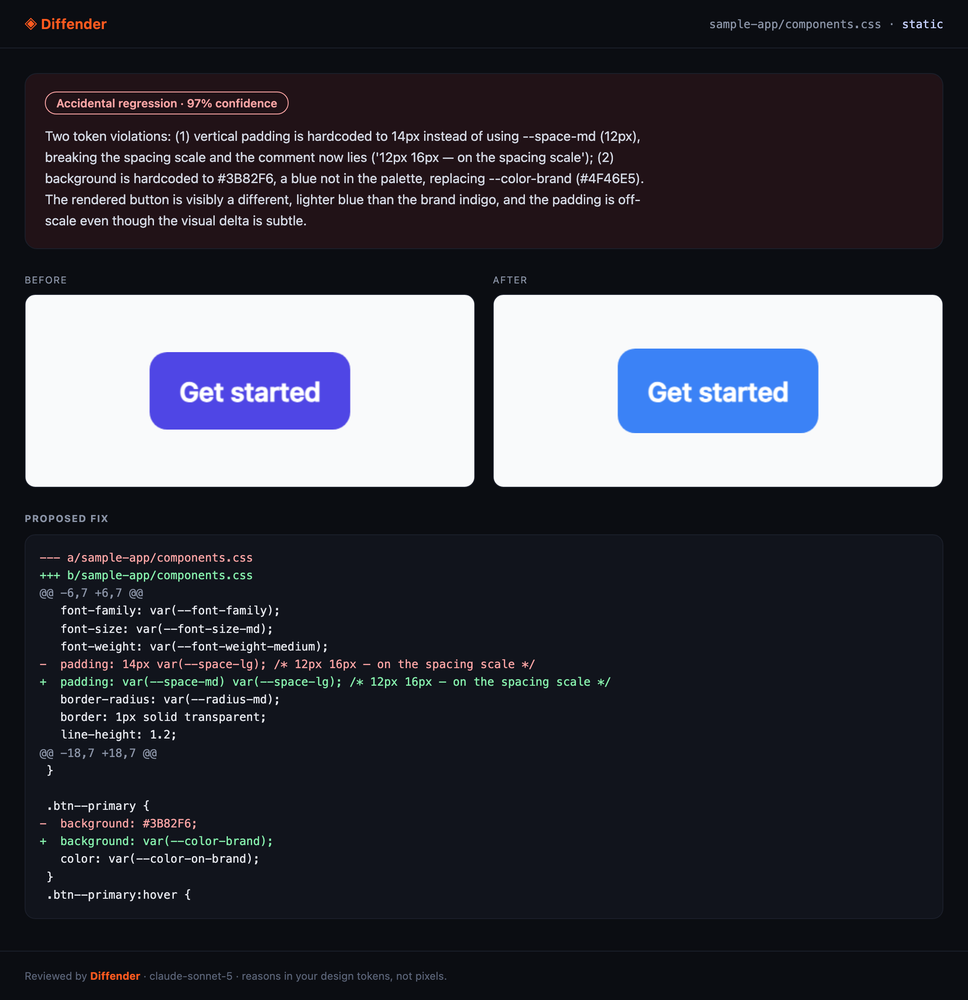
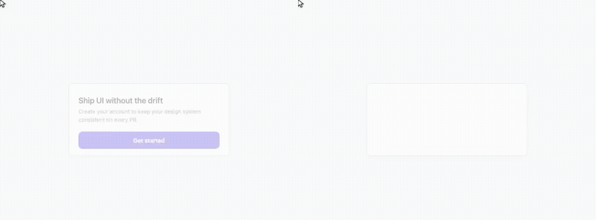

<div align="center">

# 🛡️ Diffender

**Keep your product on-brand, every commit.**

An AI-native design system that *reasons* about consistency across your product's visual and interactive surface — detecting drift, proposing reconciliation, and keeping designers and engineers aligned without a synchronization meeting.

[**diffender.studio**](https://diffender.studio) · [Live app](https://raise-hack.vercel.app) · Built at **RAISE Summit Hackathon 2026 · Cursor track** (remote)



</div>

---

## What it does

AI agents ship UI five times faster than anyone can review it. Your coding agent shows you *it runs* — but did it stay on your design system? **Diffender is the agent that defends it.**

1. 🎨 **Extract** — connect a live app URL and Diffender extracts its *real* design system (colors, type scale, spacing, motion, components) from the rendered DOM.
2. 🛡️ **Defend** — on every commit, the **Design Guardrails** agent replays your real UI *before vs after*, and a vision model classifies the change — `accidental_regression` · `intentional_redesign` · `platform_constraint` — **reasoning in your design tokens** and drafting the fix. One click applies it.
3. 💬 **Reason** — describe an intent in the design chat (*“a primary CTA for a destructive action”*) and Diffender shows which existing tokens & components **satisfy** it vs **conflict** with it.
4. 🎬 **Bonus: ship the demo** — describe a flow and Diffender **drives your real app deterministically** (not a flaky screen recording), filming a captioned, voiced, share-ready demo video — mobile or desktop, cloned voice-over, branded intro/outro, one-click share to Slack.

> The review classifies, explains its reasoning **in your tokens**, and drafts a fix for anything flagged — a materialization of the Cursor track's Statement One, including its three example projects (the visual-regression classifier, the design-intent chat, and live token extraction).

## See it

**A real verdict, from the real engine** — an off-scale padding + off-palette hex, caught and fixed:



**Before/after flow replay** (same deterministic steps on both sides — honest comparison):



**A generated demo of a real production app** (mobile emulation, synthetic touch + iOS keyboard, live backend — the stock counter really increments):


## How it works

```
                        ┌─────────────────────────────────────────────┐
   git (HEAD vs work)   │              mcp-server/  (the engine)      │
   or live URL     ───► │  planner (Nemotron) → Playwright replay     │
                        │  (real DOM · synthetic cursor · captions)   │
                        │        ├── VLM verdict in your tokens ──►  self-contained review report
                        │        └── compose + Gradium voice-over ─►  share-ready demo video (mp4)
                        └─────────────────────────────────────────────┘
                                   ▲                    │
              Cursor (/commands, MCP tools)      web/  dashboard (Next.js)
                                                 cloudflare/  public share + analytics
```

- **Deterministic by design** — the flow is planned once, then replayed identically on *before* and *after*. Same steps, same timing: apples to apples.
- **The verdict names tokens, not pixels** — `--space-md`, the 4px scale, `--color-brand` — and proposes the minimal diff back to the system.
- **Real apps, really** — drives protected deployments (headers/auth injection), mobile emulation with synthetic touch + iOS keyboard, and write-mode against live backends.

## Architecture

| Directory | What lives there |
|---|---|
| **`web/`** | The Diffender app — Next.js 16 (App Router) + Tailwind v4 + shadcn + Clerk. Dashboard: **Design System** (extracted tokens per project, editable), **Diff Render** (per-commit Design Guardrails alerts + Fix-it), **Demo** (the generate wizard: URL → device → voice from Assets → editable AI script → video), **Assets** (cloned voice, webcam photos), **Channels** (Slack). |
| **`mcp-server/`** | The engine — Node + TypeScript. MCP stdio server for Cursor, the Playwright recorder, the AI flow planner, the VLM review, the video compositor, Gradium TTS, dembrandt extraction. |
| **`cloudflare/`** | Public share pages (`/v/:id`) on Workers + R2 video storage + D1 view analytics (salted-hash IPs, never raw). |
| **`sample-app/`** | A tiny token-driven design system used as the review demo surface. |
| **`docs/`** | State, vision, and integration notes. |

## Install

```bash
# 1 — the engine (pulls Chromium via Playwright)
cd mcp-server && npm install
cp .env.example .env      # add ANTHROPIC_API_KEY (review) — optional: NEBIUS_API_KEY (planner),
                          # GRADIUM_API_KEY (voice), FAL_KEY (avatar)

# 2 — the web app
cd ../web && npm install
cp .env.example .env.local   # optional: Clerk keys (GitHub login), SLACK_BOT_TOKEN
npm run dev                  # → http://localhost:3000
```

Requirements: Node 20+, `ffmpeg` on PATH.

## Commands

### In Cursor (MCP + slash commands)
`.cursor/mcp.json` registers the MCP server. Then:

| Command | What it does |
|---|---|
| `/drift` | Review the current edit — before/after render + verdict in tokens + proposed fix |
| `/drift-motion` | Same, but judges the **interaction** (hover/transition frames) against motion tokens |
| `/drift-flow` | Replays a full user flow before/after → side-by-side video report |
| `/extract-design-system` | Extract a live app's design system (dembrandt) into Diffender |

### Engine CLIs (from `mcp-server/`)

| Command | What it does |
|---|---|
| `npm run review` | Static design-drift review of the sample app |
| `npx tsx src/cli-demo.ts` | **Goal + URL → demo video** (plan → captioned deterministic replay → compose → voice) |
| `npx tsx src/cli-repo.ts` | **Repo → demo video** (serves it, then same pipeline) |
| `npx tsx src/cli-extract.ts <url>` | Extract a live design system to the console |
| `npx tsx src/cli-plan.ts` | Watch the AI planner turn a natural-language goal into concrete steps |
| `npx tsx src/moneyshot.ts` | Regenerate the flagship review report (drift → verdict → PNG) |
| `npx tsx src/cli-walktour.ts` | The dogfood: Diffender films its own app for the submission video |

Key env knobs for `cli-demo`: `DEMO_URL`, `DEMO_GOAL`, `DEMO_DEVICE=mobile|desktop`, `DEMO_VOICE`, `DEMO_SCRIPT` (edited narration), `DEMO_HEADERS` / `DEMO_INIT` (drive protected deployments).

## Built with

Developed with **Cursor** · **NVIDIA Nemotron** via **Nebius Token Factory** (plans the demo flow) · **Gradium** (cloned voice-over) · **Cloudflare** Workers/R2/D1 (share + analytics) · **dembrandt** (design-system extraction) · Playwright · ffmpeg · Vercel AI SDK · Clerk · Next.js.

---

<div align="center">

**Everything in this repo was built during the hackathon** — including the submission video, which was generated by Diffender itself. 🛡️

*Ship the demo, not just the code.*

</div>
